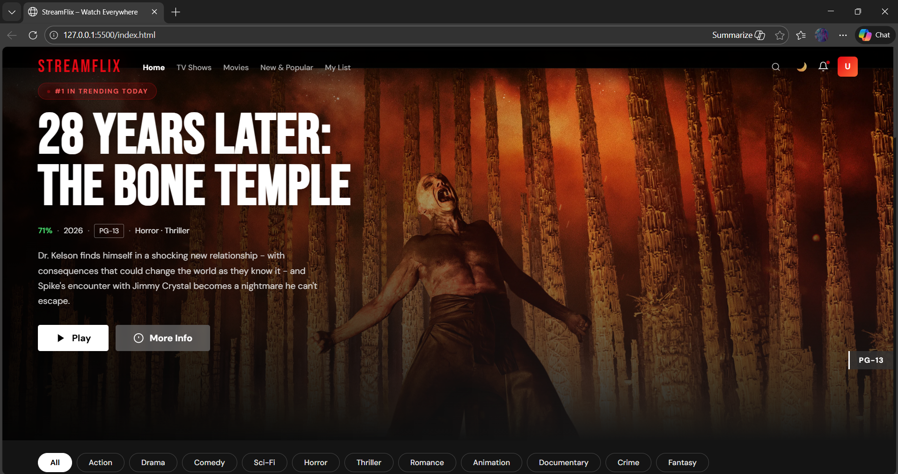
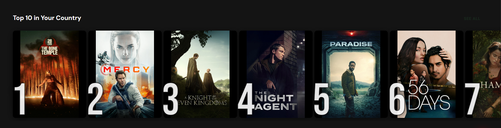
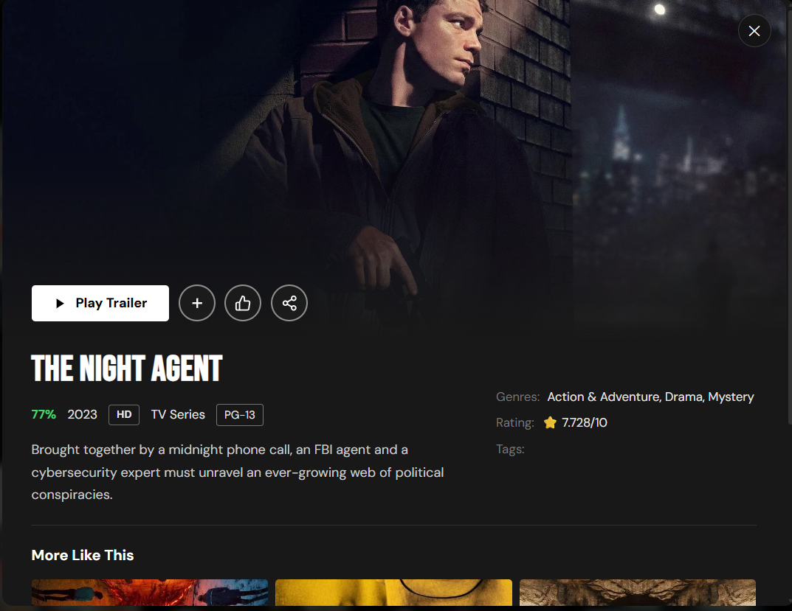

# 🎬 StreamFlix v2 — Netflix Clone

A production-grade Netflix-inspired streaming UI built with **pure HTML, CSS & JavaScript** — no frameworks, no dependencies.

> ⚠️ Built for portfolio purposes. Not affiliated with Netflix.

---

## 🌍 Live Demo

👉 (Add your deployed link here once hosted)  
Example: https://streamflix-demo.netlify.app

---

## 📸 Screenshots

_Add screenshots here (recommended):_

<p align="center">
  
</p>
<p align="center">
  
</p>
<p align="center">
  
</p>

---

## 📁 File Structure

```
streamflix/
├── index.html      ← Main app (home, TV, movies, routing)
├── login.html      ← Auth page (sign in / sign up)
├── style.css       ← All styles (dark/light theme, animations)
├── app.js          ← Main app logic
├── auth.js         ← Login/signup validation
├── sw.js           ← Service Worker (PWA / offline)
├── manifest.json   ← PWA manifest (installable app)
└── README.md       ← Project documentation
```

---

## ✨ Features

### 🔐 Authentication
- Sign In / Sign Up forms with validation
- Password strength meter
- Show/hide password toggle
- Remember me & guest mode
- Session stored in localStorage

### 🌐 TMDb API Integration
- Real movie & TV data from The Movie Database
- Fallback to local demo data if API key is missing
- Async/await + Promise.all for parallel fetching
- Trailer fetching from TMDb video endpoint

### 🎬 Video Player
- YouTube trailer embed via TMDb trailer API
- Custom controls (Play/Pause, Skip ±10s, Volume, Fullscreen)
- Watch progress saved to localStorage
- Continue Watching section with progress bars

### 🗺️ SPA Routing (Hash-based)
- `#/` Home
- `#/tv` TV Shows
- `#/movies` Movies
- `#/new` New & Popular
- `#/mylist` My List
- Browser back/forward navigation supported

### 🌙 Dark / Light Mode
- Toggle via button or `T` key
- Theme persisted in localStorage
- Smooth CSS variable transitions

### 🔍 Debounced Search
- 350ms debounce (optimized input handling)
- Searches title, genres, and overview
- Live result grid with count indicator

### ❤️ My List
- Add/remove from cards or modal
- Persistent storage via localStorage
- Dedicated My List route

### ⌨️ Keyboard Shortcuts

| Key | Action |
|-----|--------|
| `Space` | Play / Pause |
| `F` | Fullscreen |
| `M` | Mute |
| `←` `→` | Skip ±10s |
| `↑` `↓` | Volume |
| `S` | Focus search |
| `T` | Toggle theme |
| `1-5` | Navigate routes |
| `Esc` | Close modal/player |
| `?` | Show shortcuts |

### 📱 Progressive Web App (PWA)
- Service Worker with cache-first strategy
- Installable on desktop & mobile
- Offline support after first load
- Web App Manifest configured

### 🎨 UI Enhancements
- Skeleton loaders with shimmer animation
- Intersection Observer scroll animations
- Smooth hover card effects
- Top 10 ranking overlay
- Genre filter tabs
- Toast notifications
- Mobile drawer menu
- Back-to-top button
- Featured hero banner

---

## 🚀 How to Run

### Run Locally (Recommended)

Use a local server:

```bash
npx serve .
```

or

```bash
python -m http.server
```

Then open:

```
http://localhost:3000
```

⚠️ Opening directly with `file://` may break API requests.

---

## 🔑 Enable Live Movie Data (TMDb)

1. Go to: https://www.themoviedb.org/settings/api  
2. Create a free account  
3. Get your **v3 API key**  
4. Open `app.js` and update:

```js
CONFIG.TMDB_KEY = 'your_key_here'
CONFIG.USE_TMDB = true
```

---

## 🌐 Deploy (Free Options)

- **Netlify** — Drag & drop folder at app.netlify.com  
- **GitHub Pages** — Push repo → Enable Pages  
- **Vercel** — vercel.com  

---

## 🛠️ Technologies Used

- **HTML5** — Semantic markup & PWA meta
- **CSS3** — Variables, animations, flexbox, grid, media queries
- **JavaScript (ES6+)** — Modules, async/await, fetch API, IntersectionObserver
- **TMDb REST API** — Movie & TV metadata
- **YouTube iFrame API** — Trailer playback
- **Service Worker API** — Offline caching
- **localStorage API** — State persistence

---

## 🎯 What I Learned

- Building SPA routing without frameworks
- Managing application state in vanilla JS
- Implementing Service Worker caching strategy
- Handling async API integration with error fallbacks
- Designing scalable UI architecture
- Optimizing UX with skeleton loaders & debounce
- Implementing keyboard accessibility features

---

## 📝 Resume Description

> StreamFlix — A full-featured Netflix-inspired streaming UI built with vanilla HTML, CSS & JavaScript. Features include TMDb REST API integration with async/await, hash-based SPA routing, dark/light theme persistence, PWA with Service Worker offline caching, YouTube trailer integration, debounced live search, skeleton loading states, and complete keyboard shortcut support.

---

## 📌 Disclaimer

This project is for educational and portfolio purposes only.  
All movie/TV data belongs to The Movie Database (TMDb).